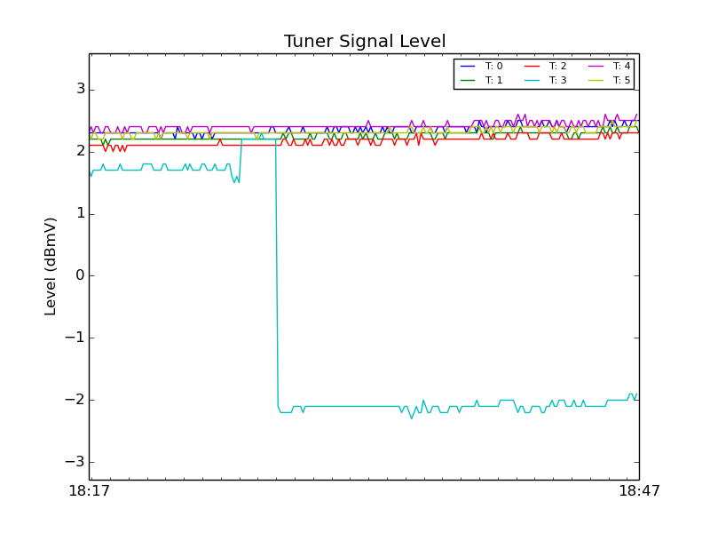
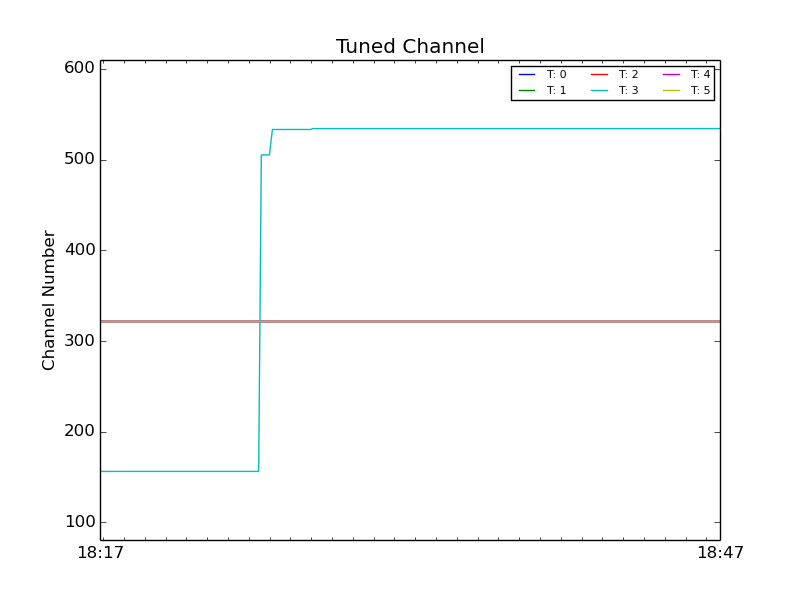
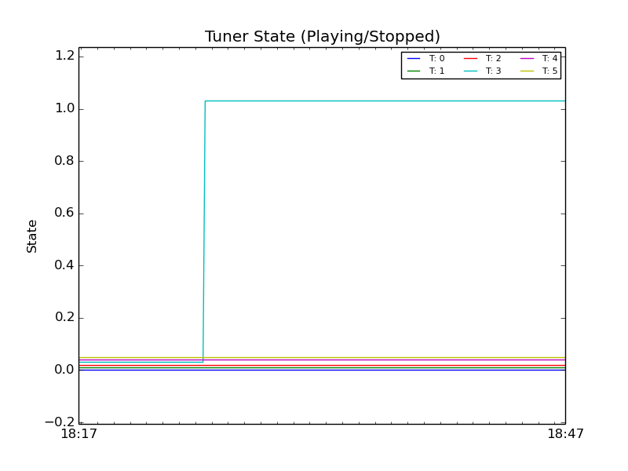

Documentation
-------------

A simple utility for logging attributes from your infiniTV Eth. 

Usage:
	python server.py ip log_rate

For example:
	python server.py 192.168.1.122 5

Logs statistics from my InfiniTV Eth with IP address "192.168.1.122" once every 5 seconds (recommended).

To view the currently logged stats point your browser to:
	http://localhost:8000/stats.py

Understanding Output:
	Non-integer values are represented without modification. Integer/boolean values (Channel, Playstate) are slightly offset by the tuner index to make it easy to differentiate between tuners. 

